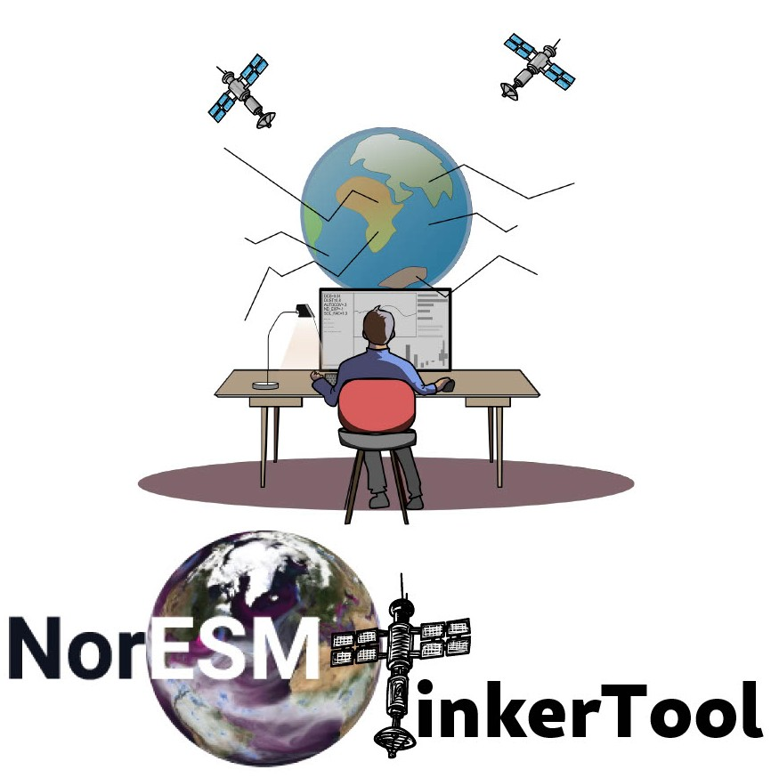

# NorESMTinkerTool
_ A safe space for tinkering _

Python tool for setting up, running and analysing perturbed parameter ensembles with the Norwegian Earth System Model
(NorESM).
By encuraging tinkering to greater extent we can better learn how the model works.



## Installation


1. Setup virtual eviroment.

```
python3 -m venv tinkertool && source tinkertool/bin/activate
```

Note that the package requires python >=3.10,<3.12 to be active in your enviroment.

2. clone repository:
```
git clone https://github.com/Ovewh/NorESMTinkerTool.git && cd NorESMTinkerTool
```

3. Install

```
pip install -e  ./
```
Or, to include optionals:
```
pip install -e  .[optional1, ..., optionalx]
```
Available optionals:

* sampling

Note that the `-e` puts the package in editable mode, if it is not included changes to configuration files etc will not be available before you re install the package.

## Contributing 
Contributions are welcome! This is supposed to be a community driven project, so if you have ideas for improvements or new features, please open an issue or a pull request on GitHub.

