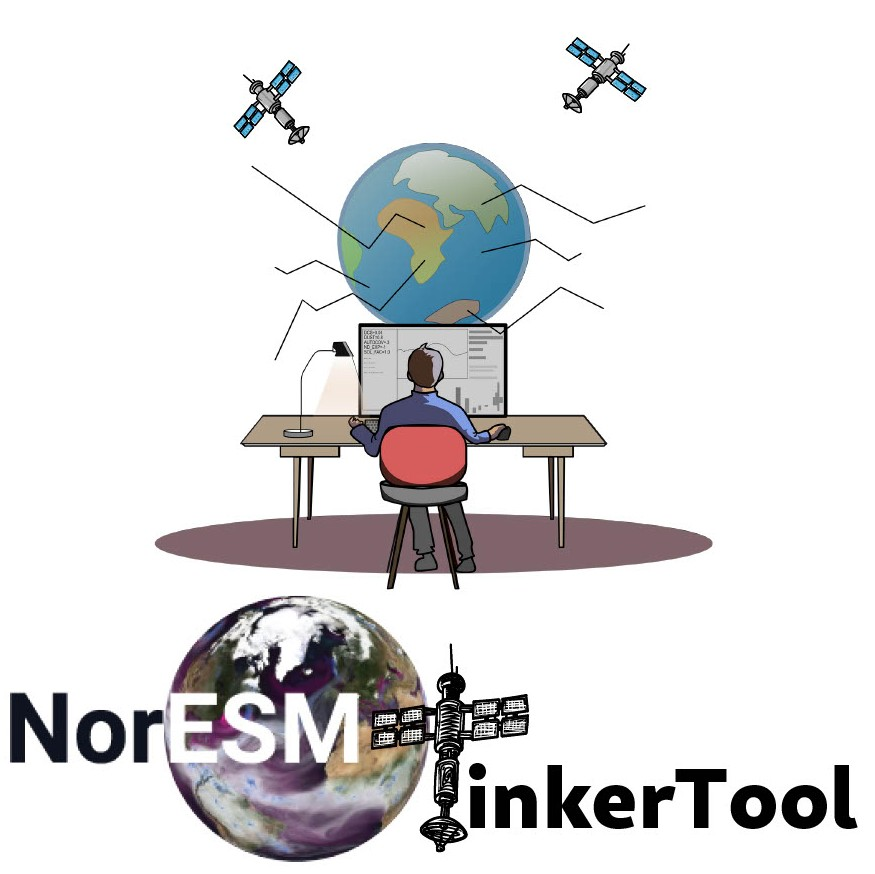

# Welcome to NorESMTinkerTool

> _A safe space for tinkering_
>

NorESMTinkerTool is a toolchain developed in Python for the development, building, production, and analysis of Perturbed Parameter Ensembles (PPEs) with the Norwegian Earth System Model (NorESM). The motivation for developing NorESMTinkerTool was to encourage more playful exploration of the model's parameter space by making tinkering with the model more accessible.

The toolchain leverages the CIME infrastructure for building and creating the perturbed parameter ensembles. Latin hyper cube sampling is used to distribute the ensemble members such that they span the parameter space most efficiently.

If you have ideas' and suggestions please have look at [contributing](contributing.md),  feedback or pull requests are very much appreciated.  

## 📚 Contents

- [Description of repository](description.md)
- [Installation](installation.md)
- [Configuration](configuration.md)
- [CLI](cli.md)
- [API Usage](usage.md)
- [API Reference](api.md)
- [Examples](examples.md)
- [FAQ](faq.md)
- [Contributing](contributing.md)
- [Changelog](changelog.md)