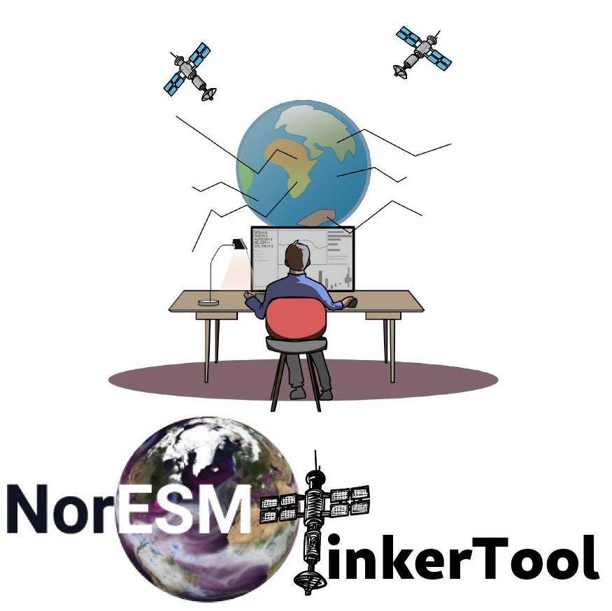

# Welcome to NorESMTinkerTool
> _A safe space for tinkering_
>

NorESMTinkerTool is a toolchain developed in Python, designed to facilitate the setup, production, and analysis of perturbed parameter ensembles (PPEs) with the Norwegian Earth System Model (NorESM). By making tinkering easy and fun, we can better learn how the model works.

## 📚 Contents

- [Installation](installation.md)
- [Configuration](configuration.md)
- [CLI](cli.md)
- [API Usage](usage.md)
- [API Reference](api.md)
- [Examples](examples.md)
- [FAQ](faq.md)
- [Contributing](contributing.md)
- [Changelog](changelog.md)